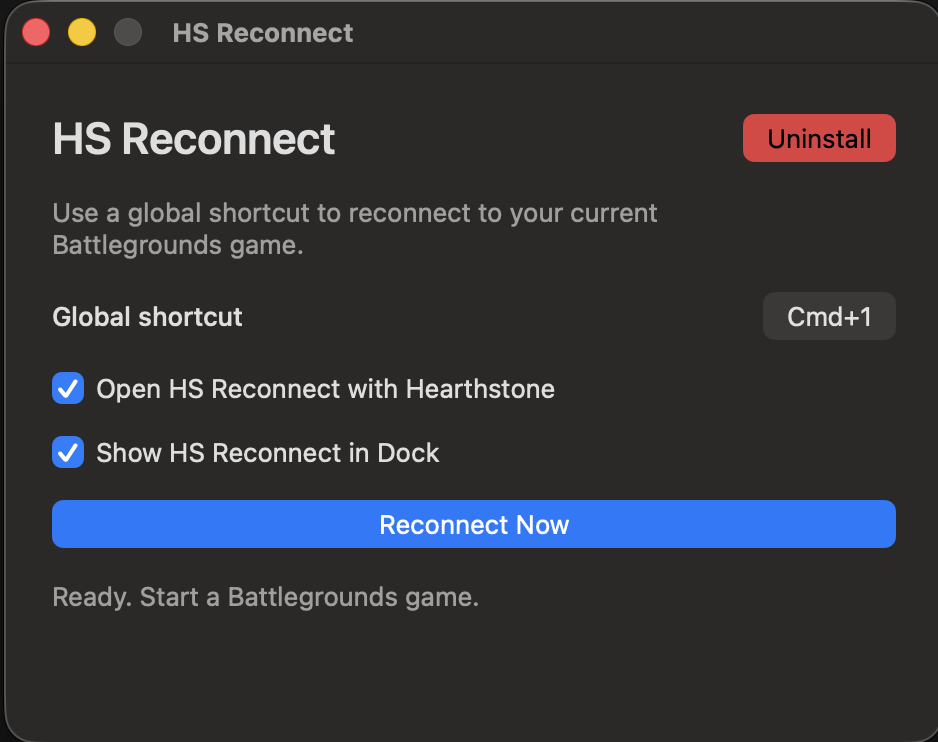

<p align="center">
  
</p>

<h1 align="center">Hearthstone Reconnect Tool for Mac</h1>

<p align="center">
  <strong>HS Reconnect</strong> — a free, native Hearthstone Battlegrounds reconnect tool for macOS.
</p>

<p align="center">
  <a href="https://github.com/kulibabkaaa/hearthstone-reconnect-macos/releases/latest"></a>
  
  
  <a href="LICENSE"></a>
</p>

<h3 align="center">
  <a href="https://github.com/kulibabkaaa/hearthstone-reconnect-macos/releases/latest/download/HS-Reconnect-1.0.0.dmg">Download HS Reconnect 1.0.0</a>
  ·
  <a href="https://kulibabkaaa.github.io/Hearthstone-Reconnect-MacOS/">Website and install guide</a>
</h3>

<p align="center">
  Free, open source, signed with Apple Developer ID, and notarized by Apple.
</p>

<p align="center">
  
</p>

## What it does

HS Reconnect is a native Hearthstone reconnect tool for Mac. Press one global
shortcut to reconnect your current Hearthstone Battlegrounds game without
closing and reopening the game. The default is **Command-Shift-W**, and you can
change it inside the app.

HS Reconnect can open quietly with Hearthstone, stay available in the menu bar,
and show or hide its Dock icon whenever you choose.

## Requirements

- macOS 13 or later
- Apple silicon or Intel Mac
- The native macOS version of Hearthstone

## Install

1. [Download HS Reconnect 1.0.0](https://github.com/kulibabkaaa/hearthstone-reconnect-macos/releases/latest/download/HS-Reconnect-1.0.0.dmg).
2. Open the disk image, then open **Install HS Reconnect.pkg**.
3. Complete the installer and open HS Reconnect from Applications or its
   Desktop shortcut.
4. Approve the Network Extension and network configuration when macOS asks.

If you dismiss the first approval message, reopen HS Reconnect and select
**Open System Settings** beside the setup message. The app keeps that guidance
available until setup is complete.

Leave **Open HS Reconnect with Hearthstone** checked to start the app quietly
with the game. The menu bar and Dock icons are visible by default; turn off
**Show HS Reconnect in Dock** if you prefer menu-bar-only operation.

## How it works

HS Reconnect uses a local macOS Network Extension that passes native
Hearthstone game traffic through unchanged. When you reconnect, it closes only
the current Hearthstone game connection so the game reconnects immediately.

No root helper or sudo rule is installed. No HS Reconnect account or separate
online service is required.

## Uninstall

1. Open HS Reconnect and select the red **Uninstall** button.
2. Confirm removal and enter your Mac administrator password.

The uninstaller removes HS Reconnect, its Network Extension, local settings,
Desktop shortcut, and installer receipt.

## Privacy

HS Reconnect has no analytics, telemetry, advertising, remote crash reporting,
accounts, or project-server connection. It does not collect or transmit personal
data. Read the full [privacy statement](PRIVACY.md).

GitHub records the cumulative `download_count` for the signed DMG attached to
each release. This measures release-asset downloads, not installations or active
users. GitHub maintains this count; the app contains no download tracking.

## FAQ

### Is there a Hearthstone reconnect tool for Mac?

Yes. HS Reconnect is built specifically for the native macOS version of
Hearthstone. It supports Apple silicon and Intel Macs running macOS 13 or later.

### How do I reconnect Hearthstone Battlegrounds on macOS?

Keep HS Reconnect open while playing, then press **Command-Shift-W** during a
match. The app closes the current Hearthstone game connection so Hearthstone
can reconnect immediately. You can change the shortcut in the app.

### Does it support Apple silicon and Intel Macs?

Yes. The signed installer supports both Apple silicon and Intel Macs.

### Why does macOS ask for Network Extension permission?

The one-time approval lets HS Reconnect handle the native Hearthstone game
connection locally and close it when you request a reconnect.

### Does it work with Windows or CrossOver?

No. Version 1.0.0 supports only the native macOS version of Hearthstone.

### Does it inspect or save my game traffic?

No. The Network Extension passes Hearthstone traffic through unchanged and
does not inspect or store its contents.

## Build from source

The project requires Xcode 16 or later and
[XcodeGen](https://github.com/yonaskolb/XcodeGen).

```sh
swift test
Scripts/build-local.sh
```

Public builds require Developer ID Application and Developer ID Installer
certificates, Network Extension provisioning, and Apple notarization.

## Support

Found a problem? [Open an issue](https://github.com/kulibabkaaa/hearthstone-reconnect-macos/issues)
or email `hsreconnect@gmail.com`.

## Disclaimer

HS Reconnect is unofficial and is not affiliated with, endorsed by, or
sponsored by Blizzard Entertainment. Use it at your own risk. Game behavior
and policies may change.

HS Reconnect is free software released under the [MIT License](LICENSE).
